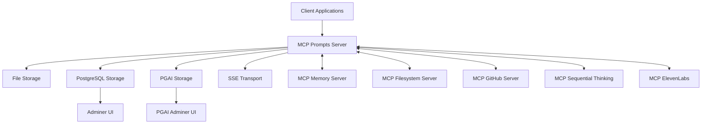

# MCP Prompts Docker Setup

This directory contains the Docker and Docker Compose files for running MCP Prompts in various environments and configurations.

## Directory Structure

```
docker/
├── compose/                      # Docker Compose configuration files
│   ├── docker-compose.base.yml   # Base configuration for all environments
│   ├── docker-compose.development.yml  # Development environment overrides
│   ├── docker-compose.test.yml   # Test environment overrides
│   ├── docker-compose.postgres.yml  # PostgreSQL integration
│   ├── docker-compose.pgai.yml   # PGAI (TimescaleDB AI) integration
│   ├── docker-compose.sse.yml    # Server-Sent Events support
│   └── docker-compose.integration.yml  # Multiple MCP servers integration
├── scripts/                      # Helper scripts
│   ├── docker-compose-manager.sh # Main script for managing Docker Compose
│   ├── cleanup-docker-files.sh   # Script for cleaning up legacy Docker files
│   ├── test-docker-configurations.sh  # Script for testing Docker configurations
│   ├── build-and-publish.sh      # Script for building and publishing Docker images
│   └── update-docker-commands-in-docs.sh  # Update documentation with new Docker commands
├── postgres/                     # PostgreSQL initialization scripts
├── Dockerfile.prod               # Production Dockerfile (main)
├── Dockerfile.development        # Development environment Dockerfile
└── Dockerfile.testing            # Testing environment Dockerfile
```

## Docker Compose Manager

The `scripts/docker-compose-manager.sh` script simplifies the management of Docker Compose configurations. It allows you to combine different Docker Compose files based on your needs.

### Basic Usage

```bash
# Start MCP Prompts in production mode
./docker/scripts/docker-compose-manager.sh up

# Start MCP Prompts in development mode
./docker/scripts/docker-compose-manager.sh up -e development

# Start MCP Prompts with PostgreSQL
./docker/scripts/docker-compose-manager.sh up -p postgres

# Start MCP Prompts with PostgreSQL and Adminer
./docker/scripts/docker-compose-manager.sh up -p postgres -p adminer

# Build a Docker image for production
./docker/scripts/docker-compose-manager.sh image -e production -t 1.0.0

# Build and publish Docker images
./docker/scripts/docker-compose-manager.sh publish -t 1.0.0

# Start MCP Prompts with all integrations in development mode
./docker/scripts/docker-compose-manager.sh up -e development -p postgres -p github -p sse -p thinking -p elevenlabs
```

### Available Environments

- `production` (default): Production environment
- `development`: Development environment with hot-reloading
- `test`: Testing environment

### Available Profiles

- `postgres`: PostgreSQL database
- `adminer`: Adminer database UI
- `pgai`: PGAI (TimescaleDB AI) integration
- `sse`: Server-Sent Events support
- `github`: GitHub MCP server integration
- `thinking`: Sequential Thinking MCP server
- `elevenlabs`: ElevenLabs MCP server
- `integration`: Full integration with multiple MCP servers

## Docker Images

### Main Image

The main Dockerfile builds a production-ready image for MCP Prompts:

```bash
# Build the production image
docker build -t sparesparrow/mcp-prompts:latest -f docker/Dockerfile.prod .
```

### Development Image

The development Dockerfile includes hot-reloading and debugging tools:

```bash
# Build the development image
docker build -t sparesparrow/mcp-prompts:dev -f docker/Dockerfile.development .
```

### Test Image

The test Dockerfile is configured for running tests:

```bash
# Build the test image
docker build -t sparesparrow/mcp-prompts:test -f docker/Dockerfile.testing .
```

## Building and Publishing Docker Images

A convenience script is provided for building and publishing Docker images:

```bash
# Build and publish all images with a specific tag
./docker/scripts/build-and-publish.sh 1.0.0

# Or use the Docker Compose Manager
./docker/scripts/docker-compose-manager.sh publish -t 1.0.0
```

## Environment Variables

The Docker Compose files use environment variables that can be set in a `.env` file or directly in the environment:

- `STORAGE_TYPE`: Storage type (`file` or `postgres`)
- `PROMPTS_DIR`: Directory for storing prompts
- `BACKUPS_DIR`: Directory for storing backups
- `GITHUB_TOKEN`: GitHub personal access token
- `ELEVENLABS_API_KEY`: ElevenLabs API key
- `PGAI_API_KEY`: PGAI API key

## Examples

### Running with PostgreSQL and File Storage

This setup uses PostgreSQL for metadata and file storage for prompt content:

```bash
./docker/scripts/docker-compose-manager.sh up -p postgres
```

### Development Environment with Multiple MCP Servers

This setup creates a full development environment with multiple MCP servers:

```bash
./docker/scripts/docker-compose-manager.sh up -e development -p postgres -p github -p sse
```

### Integration Testing

This setup runs integration tests with all services:

```bash
./docker/scripts/docker-compose-manager.sh up -e test -p integration
```

## Architecture Diagram



## Docker Compose Configurations

The project uses multiple Docker Compose configurations for different purposes:

### Base Configuration (`docker-compose.base.yml`)
- Provides the base configuration for the MCP-Prompts server
- Used as a foundation for all other configurations

### Development Environment (`docker-compose.development.yml`)
- Includes a development server with live reloading
- Uses a separate PostgreSQL database on port 5442
- Exposes port 3004 for web access
- Enables Node.js inspector on port 9229

### Integration Testing (`docker-compose.integration.yml`)
- Sets up multiple MCP server instances:
  - File-based server on port 3005
  - Memory-based server on port 3010
  - GitHub-based server on port 3011
- Configures persistent volume for file data

### PostgreSQL Support (`docker-compose.postgres.yml`)
- Adds PostgreSQL database for production use
- Includes Adminer for database management

### Test Environment (`docker-compose.test.yml`)
- Configures unit and integration test environments
- Uses a separate test PostgreSQL database
- Doesn't expose external ports

### PGAI Support (`docker-compose.pgai.yml`)
- Configures AI-assisted PostgreSQL environment

### Server-Sent Events Support (`docker-compose.sse.yml`)
- Configures Server-Sent Events support for MCP Prompts

## Testing Docker Configurations

To test all Docker Compose configurations:

```bash
./docker/scripts/test-docker-configurations.sh
```

## Cleaning Up Docker Resources

To clean up all Docker resources and legacy files:

```bash
# Clean up Docker resources
docker compose down -v
docker network prune

# Clean up legacy Docker files
./docker/scripts/cleanup-docker-files.sh
```

## Volumes

The following volumes are used:
- `mcp-prompts-data`: For file-based prompt storage
- `mcp-prompts-postgres-data`: For PostgreSQL data persistence
- `mcp-prompts-postgres-test-data`: For test database data

## Networks

All containers connect to the `mcp-network` for internal communication.

## Container Health Checks

All containers include health checks to ensure they're running properly. You can check container health with:

```bash
docker compose ps
```

## Image Publishing

When creating new releases, build and publish the Docker image:

```bash
# Using the build-and-publish script
./docker/scripts/build-and-publish.sh x.y.z

# Or manually
docker build -t sparesparrow/mcp-prompts:latest -f docker/Dockerfile.prod .
docker tag sparesparrow/mcp-prompts:latest sparesparrow/mcp-prompts:x.y.z
docker push sparesparrow/mcp-prompts:latest
docker push sparesparrow/mcp-prompts:x.y.z
```

## Best Practices

1. Always use named volumes for persistent data
2. Include health checks for all services
3. Use appropriate restart policies based on the environment
4. Separate development, testing, and production configurations
5. Use environment variables for configuration
6. Follow the principle of least privilege for container security 
7. Never run containers as root in production
8. Always pin specific versions for dependencies
9. Use multi-stage builds for production images
10. Include proper cleanup mechanisms for development and test environments 